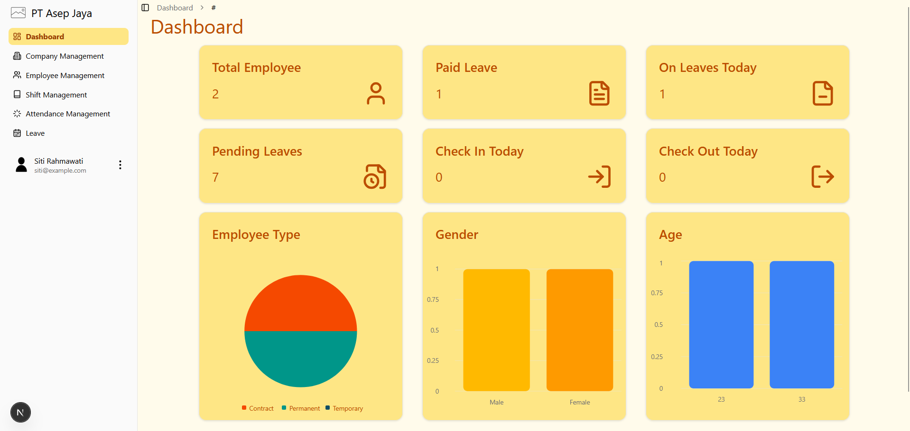
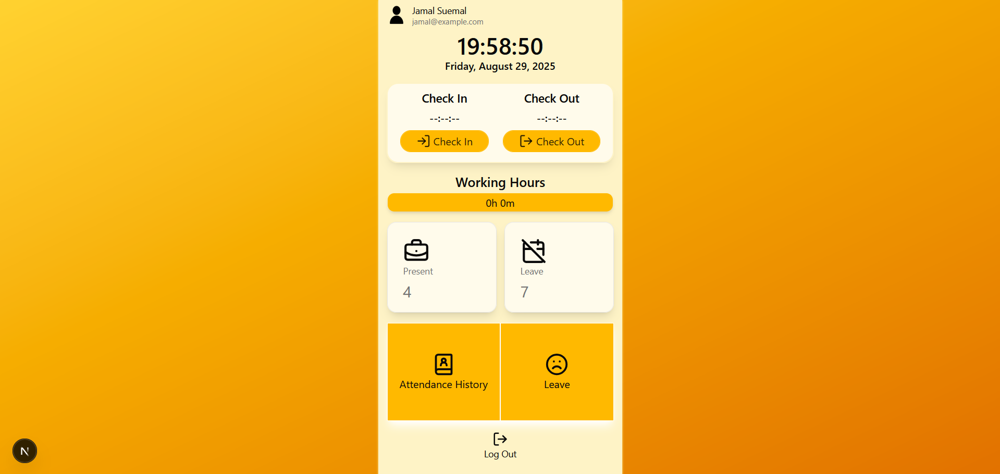

# Final Project FE - Enrico Zada

Human Resource Management System (HRMS) web application built with **Next.js**, **TypeScript**, **TailwindCSS**, and **Shadcn UI**.  
This application helps manage employee attendance, leave requests, company details, and more — with separate dashboards for **Admin** and **Staff**.

---

## 🚀 Features

### 🔑 Authentication

- Login & Register pages
- Role-based access (Admin / Staff)
- Middleware route protection

### 👨‍💼 Admin Module

- **Dashboard**: Overview of company stats
- **Attendance**: Manage & monitor employee attendance
- **Company**: Company profile & configuration
- **Leave**: Approve/reject leave requests
- **Shift**: Manage shift schedules
- **Users**: Manage employee accounts

### 👷 Staff Module

- **Dashboard**: Personal attendance overview
- **Attendance**: Check-in / Check-out system
- **Leave**: Submit leave requests
- **Profile**: Update personal information

---

## 📂 Project Structure

```bash
final-project-fe-enrico-zd/
├── src/
│   ├── app/                          # Next.js App Router pages
│   │   ├── admin/                    # Admin routes
│   │   │   ├── attendance/
│   │   │   ├── company/
│   │   │   ├── dashboard/
│   │   │   ├── leave/
│   │   │   ├── shift/
│   │   │   └── users/
│   │   │
│   │   ├── staff/                    # Staff routes
│   │   │   ├── attendance/
│   │   │   ├── dashboard/
│   │   │   ├── leave/
│   │   │   └── profile/
│   │   │
│   │   ├── api/                      # API Routes (serverless functions)
│   │   │   ├── auth/                 # Authentication routes
│   │   │   └── uploadthing/          # File upload handling (UploadThing
│   │   │
│   │   ├── login/                    # Auth login page
│   │   ├── register/                 # Auth register page
│   │   ├── layout.tsx                # Root layout
│   │   └── page.tsx                  # Landing page
│   │
│   ├── components/                   # Reusable UI components
│   ├── hooks/                        # Custom React hooks
│   ├── lib/                          # Utility libraries (date, time, formatting, etc.)
│   ├── providers/                    # Context providers (e.g., AuthProvider)
│   ├── services/                     # API service functions (fetch wrappers)
│   ├── types/                        # TypeScript interfaces & enums
│   └── utils/                        # Extra utility/helper functions
│
├── middleware.ts                     # NextAuth / route middleware
├── .env.local                        # Environment variables
└── package.json

```

---

## 🛠️ Tech Stack

- [Next.js](https://nextjs.org/)
- [TypeScript](https://www.typescriptlang.org/)
- [Tailwind CSS](https://tailwindcss.com/)
- [Shadcn UI](https://ui.shadcn.com/)
- [NextAuth.js](https://next-auth.js.org/) – Authentication
- [Lucide React](https://lucide.dev/) – Icons

---

## ⚙️ Setup & Installation

### 1. Clone Repository

```bash
git clone https://github.com/enrico-zd/final-project-fe-enrico-zd.git
cd final-project-fe-enrico-zd
```

### 2. Install Dependencies

```bash
npm install
# or
yarn install
```

### 3. Setup Environment

```bash
NEXTAUTH_SECRET=your-secret
NEXTAUTH_URL=http://localhost:3000
API_URL=http://localhost:5000
```

### 4. Run Development Server

```bash
npm run dev
```

## 🌐 Live Demo

### Admin Dashboard Screenshot


### Staff Dashboard Screenshot

<br/>

👉 [Live Demo on Vercel](https://final-project-fe-enrico-zd.vercel.app/)
